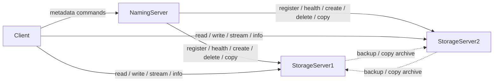

# Network File System

A distributed network file system in C with a **Naming Server**, multiple **Storage Servers**, and an interactive **Client**. Clients talk to the naming server for path resolution and metadata; data plane transfers go directly to storage servers.

## Architecture



| Component | Role |
|-----------|------|
| **Naming Server** | Path trie, LRU path→server cache, storage registration, health checks, create/delete/list/copy orchestration |
| **Storage Server** | Local file root, register accessible paths, serve read/write/stream/info, peer copy & backup archives |
| **Client** | Readline CLI: `create`, `read`, `write`, `delete`, `copy`, `list`, `info`, `stream` |

Shared protocol types live in [`Utils/common.h`](Utils/common.h) (`Command`, `Response`, `StorageServer`, error codes).

## Features

- Path directory with a trie and LRU cache
- Multi-storage registration and load distribution for creates
- Sync and async writes (`write --sync`)
- Cross-server copy via tar/zip archives
- Health monitoring and backup peer assignment
- Audio streaming to `mpv` (`stream`)
- POSIX-style `info` (mode, owner, size, mtime)

## Dependencies

- GCC (C11-compatible), `make`, `pthread`
- `libreadline` (client)
- `tar` (required for copy/backup when `zip` is unavailable); optional `zip`/`unzip`
- Optional: `mpv` for audio streaming

## Build

```bash
make          # naming_server, storage_server, client
make clean
```

## Run a local cluster

```bash
./scripts/run_local.sh
# Naming server : 127.0.0.1:8080
# Storage #1    : port 9001  root=./data/ss1
# Storage #2    : port 9002  root=./data/ss2

./client 127.0.0.1 8080
./scripts/stop_local.sh
```

Manual start:

```bash
./naming_server 8080
./storage_server 127.0.0.1 8080 9001 ./data/ss1 127.0.0.1
./storage_server 127.0.0.1 8080 9002 ./data/ss2 127.0.0.1
./client 127.0.0.1 8080
```

Storage server usage:

```text
./storage_server <nm_ip> <nm_port> <listen_port> <root_path> [advertise_ip]
```

If `advertise_ip` is omitted, the server advertises `127.0.0.1` (best for local testing).

## Client commands

```text
read <path>
write [--sync] <path> <local_path>
create -f/-d [<parent_path>] <name>
delete <path>
copy <source> <dest>
list [path]                 # default /
stream <path>               # audio via mpv
info <path>
help
exit
```

Examples:

```text
create -f hello.txt
write --sync /hello.txt ./local.txt
read /hello.txt
create -d docs
create -f /docs notes.txt
list /docs
copy /hello.txt /docs
delete /docs/notes.txt
info /hello.txt
```

## Wire protocol (summary)

Binary structs over TCP (`Command` / `Response` in `Utils/common.h`):

| Command | Typical flow |
|---------|----------------|
| `CMD_REGISTER` | Storage → NM with `StorageServer` body |
| `CMD_CREATE` / `CMD_DELETE` / `CMD_LIST` / `CMD_COPY` | Client → NM (NM talks to storage as needed) |
| `CMD_READ` / `CMD_WRITE` / `CMD_STREAM` / `CMD_INFO` | Client → NM for location, then Client ↔ Storage for data |
| `CMD_PING` / `CMD_BACKUP` | NM ↔ Storage health / backup peer update |

Error codes: `ACK`, `ERR_PATH_NOT_FOUND`, `ERR_FILE_IN_USE`, `ERR_PERMISSION_DENIED`, `ERR_SERVER_DOWN`, `ERR_INVALID_PATH`, `ERR_NETWORK`.

## Replication & fault tolerance

- Each storage server is assigned up to two backup peers at registration time.
- Health checks run every few seconds; failed servers are marked down.
- Reads of paths on a down primary can be redirected to a live backup (backup path layout `./ssN/...`).
- Full-tree backup archives are pushed on recovery (not on every health tick).
- Archives use `zip` when installed, otherwise `tar.gz`.

## Testing & benchmarks

```bash
./scripts/smoke_test.sh    # create/list/write/read/info/copy/delete
./bench/benchmark.sh       # writes bench/results.md
```

Latest local results are in [`bench/results.md`](bench/results.md).

## Project layout

```text
Client/           Interactive client
NamingServer/     Naming server, trie, LRU cache
StorageServer1/   Storage server sources (canonical)
StorageServer2/   Same sources (second instance copy)
Utils/common.h    Shared protocol definitions
scripts/          run_local, stop_local, smoke_test
bench/            benchmark harness + results
Makefile
```

## Known limitations

- Metadata is in-memory on the naming server (not persisted across NM restarts).
- Backup path layout and zip/tar semantics are simplified; production HA would need stronger consistency.
- Async writes fork a child and do not surface completion to the CLI.
- No authentication or encryption on the wire.

## License

Project code as published in this repository.
